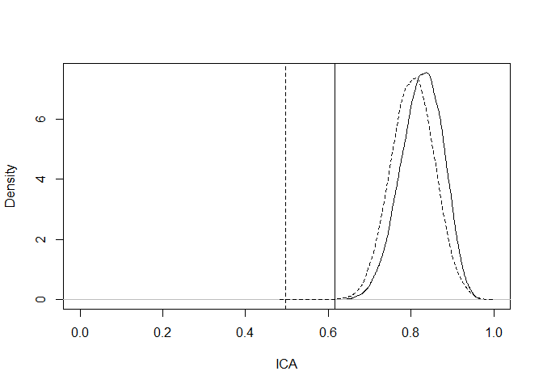

Example
================
Alvaro Flórez
8/3/2022

## MPC algorithm

Let us consider a setting with 10 surrogate endpoints, of which 8 of
these are non-informative. The variance-covariance matrix is the
following:

``` r
library(ks)
Sigma = invvech(
  c(25, NA, 17.8, NA, -10.6, NA, 0, NA, 0, NA, 0, NA, 0, NA, 0, NA, 0, NA, 0, NA, 0, NA, 
    4, NA, -0.32, NA, -1.32, NA, 0, NA, 0, NA, 0, NA, 0, NA, 0, NA, 0, NA, 0, NA, 0, 16, 
    NA, -4, NA, 0, NA, 0, NA, 0, NA, 0, NA, 0, NA, 0, NA, 0, NA, 0, NA, 1, NA, 0.48, NA, 
    0, NA, 0, NA, 0, NA, 0, NA, 0, NA, 0, NA, 0, NA, 0, 16, NA, 0, NA, 0, NA, 0, NA, 0, 
    NA, 0, NA, 0, NA, 0, NA, 0, NA, 1, NA, 0, NA, 0, NA, 0, NA, 0, NA, 0, NA, 0, NA, 0, 
    NA, 0, 16, NA, 8, NA, 8, NA, 8, NA, 8, NA, 8, NA, 8, NA, 8, NA, 1, NA, 0.5, NA, 0.5, 
    NA, 0.5, NA, 0.5, NA, 0.5, NA, 0.5, NA, 0.5, 16, NA, 8, NA, 8, NA, 8, NA, 8, NA, 8, 
    NA, 8, NA, 1, NA, 0.5, NA, 0.5, NA, 0.5, NA, 0.5, NA, 0.5, NA, 0.5, 16, NA, 8, NA, 
    8, NA, 8, NA, 8, NA, 8, NA, 1,NA,0.5,NA,0.5,NA,0.5,NA,0.5,NA,0.5, 16, NA, 8, NA, 8, 
    NA, 8, NA, 8, NA, 1, NA, 0.5, NA, 0.5, NA, 0.5, NA, 0.5, 16, NA, 8, NA, 8, NA, 8, NA,
    1, NA, 0.5, NA, 0.5, NA, 0.5, 16, NA, 8, NA, 8, NA, 1, NA, 0.5, NA, 0.5, 16, NA, 8, NA,
    1, NA, 0.5, 16, NA, 1)) 
Sigma
```

    ##        [,1]  [,2] [,3]  [,4]  [,5]  [,6] [,7] [,8] [,9] [,10] [,11] [,12] [,13]
    ##  [1,]  25.0    NA 17.8    NA -10.6    NA    0   NA    0    NA     0    NA     0
    ##  [2,]    NA  4.00   NA -0.32    NA -1.32   NA  0.0   NA   0.0    NA   0.0    NA
    ##  [3,]  17.8    NA 16.0    NA  -4.0    NA    0   NA    0    NA     0    NA     0
    ##  [4,]    NA -0.32   NA  1.00    NA  0.48   NA  0.0   NA   0.0    NA   0.0    NA
    ##  [5,] -10.6    NA -4.0    NA  16.0    NA    0   NA    0    NA     0    NA     0
    ##  [6,]    NA -1.32   NA  0.48    NA  1.00   NA  0.0   NA   0.0    NA   0.0    NA
    ##  [7,]   0.0    NA  0.0    NA   0.0    NA   16   NA    8    NA     8    NA     8
    ##  [8,]    NA  0.00   NA  0.00    NA  0.00   NA  1.0   NA   0.5    NA   0.5    NA
    ##  [9,]   0.0    NA  0.0    NA   0.0    NA    8   NA   16    NA     8    NA     8
    ## [10,]    NA  0.00   NA  0.00    NA  0.00   NA  0.5   NA   1.0    NA   0.5    NA
    ## [11,]   0.0    NA  0.0    NA   0.0    NA    8   NA    8    NA    16    NA     8
    ## [12,]    NA  0.00   NA  0.00    NA  0.00   NA  0.5   NA   0.5    NA   1.0    NA
    ## [13,]   0.0    NA  0.0    NA   0.0    NA    8   NA    8    NA     8    NA    16
    ## [14,]    NA  0.00   NA  0.00    NA  0.00   NA  0.5   NA   0.5    NA   0.5    NA
    ## [15,]   0.0    NA  0.0    NA   0.0    NA    8   NA    8    NA     8    NA     8
    ## [16,]    NA  0.00   NA  0.00    NA  0.00   NA  0.5   NA   0.5    NA   0.5    NA
    ## [17,]   0.0    NA  0.0    NA   0.0    NA    8   NA    8    NA     8    NA     8
    ## [18,]    NA  0.00   NA  0.00    NA  0.00   NA  0.5   NA   0.5    NA   0.5    NA
    ## [19,]   0.0    NA  0.0    NA   0.0    NA    8   NA    8    NA     8    NA     8
    ## [20,]    NA  0.00   NA  0.00    NA  0.00   NA  0.5   NA   0.5    NA   0.5    NA
    ## [21,]   0.0    NA  0.0    NA   0.0    NA    8   NA    8    NA     8    NA     8
    ## [22,]    NA  0.00   NA  0.00    NA  0.00   NA  0.5   NA   0.5    NA   0.5    NA
    ##       [,14] [,15] [,16] [,17] [,18] [,19] [,20] [,21] [,22]
    ##  [1,]    NA     0    NA     0    NA     0    NA     0    NA
    ##  [2,]   0.0    NA   0.0    NA   0.0    NA   0.0    NA   0.0
    ##  [3,]    NA     0    NA     0    NA     0    NA     0    NA
    ##  [4,]   0.0    NA   0.0    NA   0.0    NA   0.0    NA   0.0
    ##  [5,]    NA     0    NA     0    NA     0    NA     0    NA
    ##  [6,]   0.0    NA   0.0    NA   0.0    NA   0.0    NA   0.0
    ##  [7,]    NA     8    NA     8    NA     8    NA     8    NA
    ##  [8,]   0.5    NA   0.5    NA   0.5    NA   0.5    NA   0.5
    ##  [9,]    NA     8    NA     8    NA     8    NA     8    NA
    ## [10,]   0.5    NA   0.5    NA   0.5    NA   0.5    NA   0.5
    ## [11,]    NA     8    NA     8    NA     8    NA     8    NA
    ## [12,]   0.5    NA   0.5    NA   0.5    NA   0.5    NA   0.5
    ## [13,]    NA     8    NA     8    NA     8    NA     8    NA
    ## [14,]   1.0    NA   0.5    NA   0.5    NA   0.5    NA   0.5
    ## [15,]    NA    16    NA     8    NA     8    NA     8    NA
    ## [16,]   0.5    NA   1.0    NA   0.5    NA   0.5    NA   0.5
    ## [17,]    NA     8    NA    16    NA     8    NA     8    NA
    ## [18,]   0.5    NA   0.5    NA   1.0    NA   0.5    NA   0.5
    ## [19,]    NA     8    NA     8    NA    16    NA     8    NA
    ## [20,]   0.5    NA   0.5    NA   0.5    NA   1.0    NA   0.5
    ## [21,]    NA     8    NA     8    NA     8    NA    16    NA
    ## [22,]   0.5    NA   0.5    NA   0.5    NA   0.5    NA   1.0

## Analysis using the PC and MPC algorithm

# Two informative surrogate

To start, we consider the evaluation of surrogacy of the first two
surrogates using the PC and MPC algorithms. Both methods are included in
the package . Let simulate *M* = 30, 000 ICA values:

``` r
library(Surrogate)
ICA.PC.2 = ICA.ContCont.MultS.PC(M = 30000, N=200, Sigma[1:6,1:6], Seed = 123) 
ICA.MPC.2 = ICA.ContCont.MultS.MPC(M = 30000, N=200, Sigma[1:6,1:6],prob=NULL, Seed = 123, Save.Corr=T, Show.Progress = TRUE) 
```

With the PC algorithm, we obtained that the ICA ranges between 0.494 and
0.997. On the other hand, ICA calculated with the MPC algorithm ranges
between 0.49 and 0.997.

Now let us consider all surrogates. Since surrogates 3 to 8 are
non-informative, we should not expect any noticeable reduction in the
ICA range.

Here, we simulate *M* = 150, 000 ICA values as follows:

``` r
ICA.PC.10 = ICA.ContCont.MultS.PC(M = 150000, N=200, Sigma, Seed = 123) 
ICA.MPC.10 = ICA.ContCont.MultS.MPC(M = 150000, N=200, Sigma,prob=NULL, Seed = 123, Save.Corr=T, Show.Progress = TRUE) 
```

With the PC algorithm, we get a narrowed ICA range (0.616, 0.981). On
the contary, the MPC algorithm leads to fairly the same ICA range that
before (0.497, 0.992).

The densities of the ICA computed using both algorithms is the
following:

``` r
library(Surrogate)
plot(density(ICA.PC.10$R2_H),xlim=c(0,1),xlab='ICA',main='')
lines(density(ICA.MPC.10$R2_H),lty=2)
abline(v=min(ICA.PC.10$R2_H))
abline(v=min(ICA.MPC.10$R2_H),lty=2)
```

<!-- -->

The one obtained from the MPC algorithm (dashed line) have heavier
left-tail, allowing for lower minimum ICA value.
